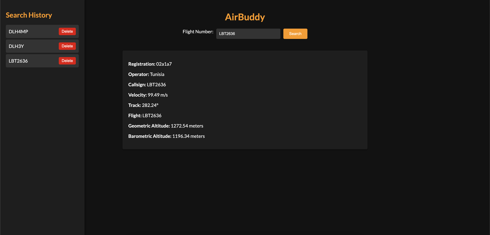

# AirBuddy - Flight Tracker App

This is a web application built with Flask, HTML, CSS, and JavaScript that allows users to track flight information using the OpenSky Network API.

## Features

- Users can input a flight number to retrieve information about that flight.
- The application displays information such as registration, model, operator, callsign, velocity, track, flight, geometric altitude, barometric altitude, and owner (if applicable) of the flight.
- The application features a dark theme for improved visibility.
- Search history is displayed in the sidebar, allowing users to easily access past flight searches.
- Users can delete past flight searches from the search history.
- 
## Screenshots

{ height=500px }

## Installation

1. Clone this repository to your local machine.
2. Install the required Python packages using pip:
   ```bash
   pip install -r requirements.txt
   ```
3. Run the Flask application:
   ```bash
   python app.py
   ```

4. Access the application in your web browser at `http://127.0.0.1:5000`.

## Usage

1. Enter a flight number in the input field.
2. Click the "Search" button.
3. Flight information will be displayed on the main screen.
4. Past searches will be listed in the sidebar.
5. To delete a past search, click the "Delete" button next to the flight in the sidebar.

## Technologies Used

- Flask
- HTML
- CSS
- JavaScript
- OpenSky Network API

## License

This project is licensed under the MIT License. See the [LICENSE](LICENSE) file for details.
